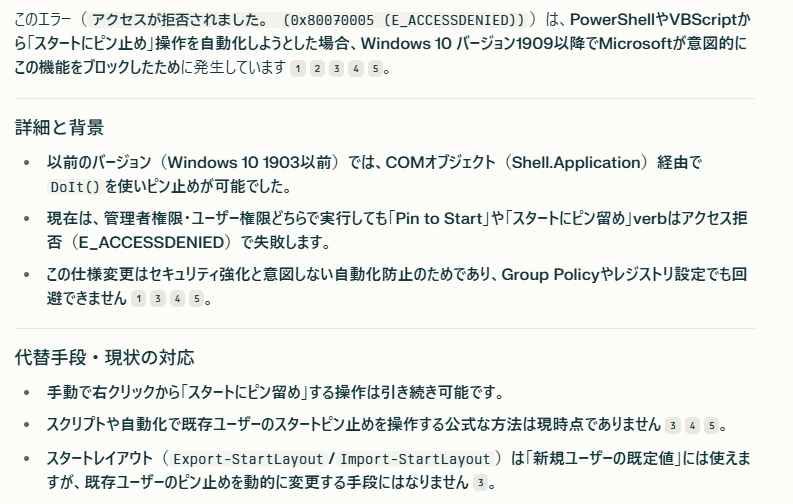

# dotfiles-windows

setup-powershell7.ps1 を実行する
環境構築をするために先に powershell7 を導入する。
UTF-8 の日本語があると標準の powershell だと強制終了して実行できないため。

その後、powershell7 で setup を行うようにする。

# Memo

## アプリケーションのインストールは MS Store 版を優先する

MS Store 版は自動更新が走る。
MSI 版はアプリ固有の自動更新が走る形になる。
WSL については MS Store 版に統一される予定らしい。

## スタートメニューへのピン留め自動化は不可

スタートメニューへのピン留めはプログラムからの実施は不可能らしい。
別途設定する。

